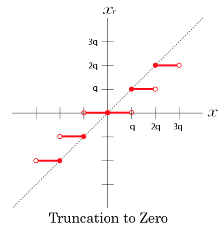
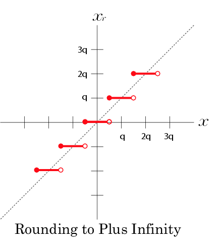
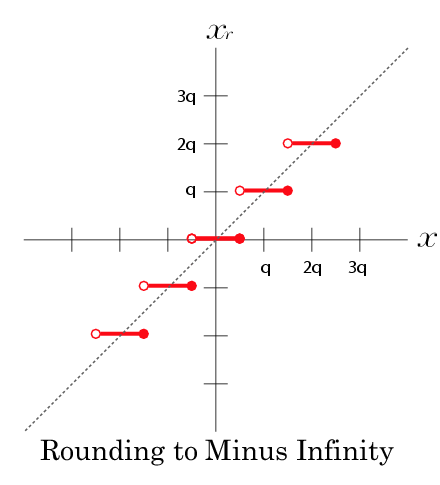
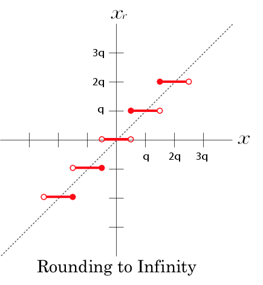
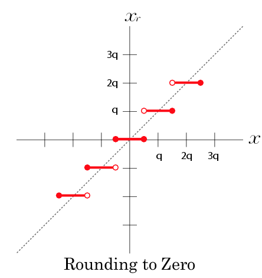
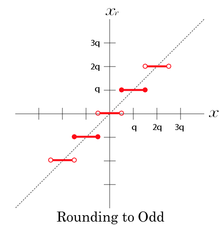

Time-stamp: <2017-01-02 20:19:31 hamada>

# 丸めモード指定用キーワード

------------------------------
## 概要

デフォルトがRoundingt to the Nearest Even だってことだけ知ってれば良いです.

------------------------------
## Truncation

------------------------------
## Truncation to Zero

------------------------------
## Rounding to Plus Infinity

------------------------------
## Rounding to Minus Infinity

------------------------------
## Rounding to Infinity</h4>

------------------------------
## Rounding to Zero</h4>

------------------------------
## Rounding to the Nearest Even</h4>

------------------------------
## Rounding to the Nearest Odd</h4>

------------------------------
## Force to one rounding</h4>

------------------------------
## 参照</h4>

------------------------------
## Change Log</I>

- 2004.08.17 : the first edition by T. Hamada

------------------------------
<i>Copyright (c) 2003-2005 by T. Hamada.</i>
