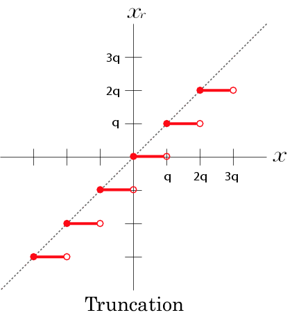
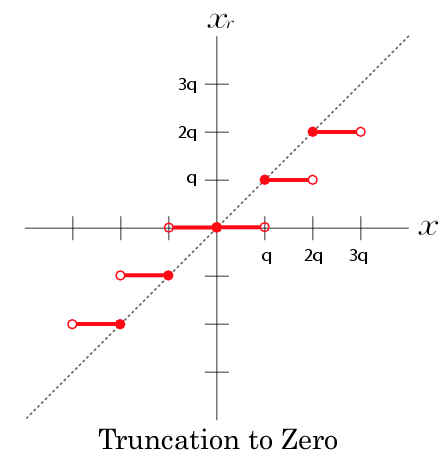
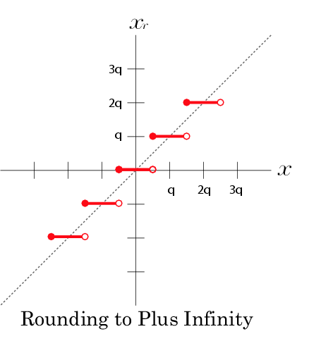
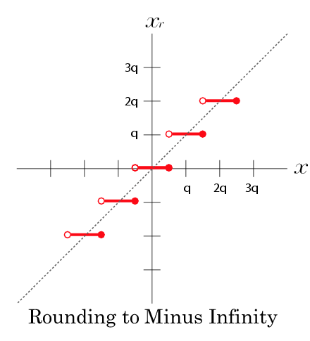
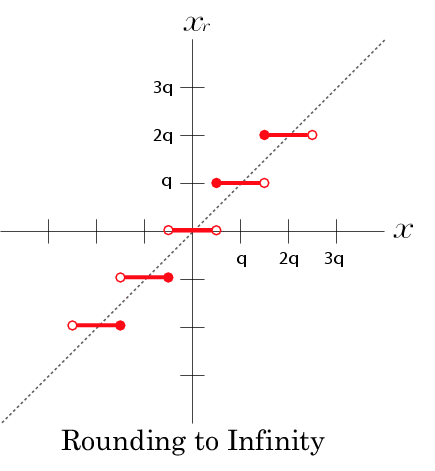
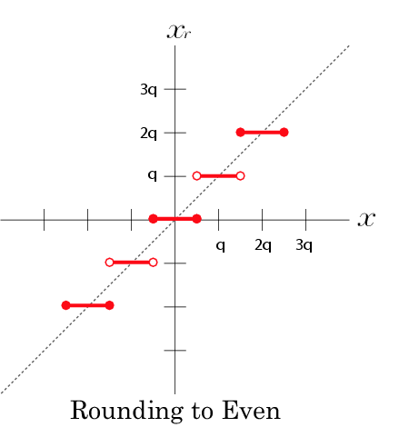
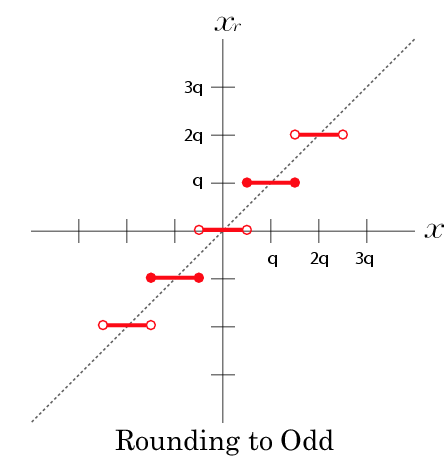

Time-stamp: <2017-01-02 20:15:57 hamada>

# 丸めモード指定用キーワード

------------------------------
## 概要

デフォルトがRoundingt to the Nearest Even だってことだけ知ってれば良いです.

------------------------------
## Truncation

------------------------------
## Truncation to Zero

------------------------------
## Rounding to Plus Infinity

------------------------------
## Rounding to Minus Infinity

<!------------------------------------>
<a name = "RINF">
<h4>Rounding to Infinity</h4>

<!------------------------------------>
<a name = "RZERO">
<h4>Rounding to Zero</h4>

<!------------------------------------>
<a name = "REVEN">
<h4>Rounding to the Nearest Even</h4>

<!------------------------------------>
<a name = "RODD">
<h4>Rounding to the Nearest Odd</h4>

<!------------------------------------>
<a name = "FORCE1">
<h4>Force to one rounding</h4>

<!------------------------------------>
<h4>参照</h4>

<I>Change Log</I>
<ul>
<li> 2004.08.17 : the first edition by T. Hamada
</ul>
<i>Copyright (c) 2003-2005 by T. Hamada.</i>
</body>
</html>
