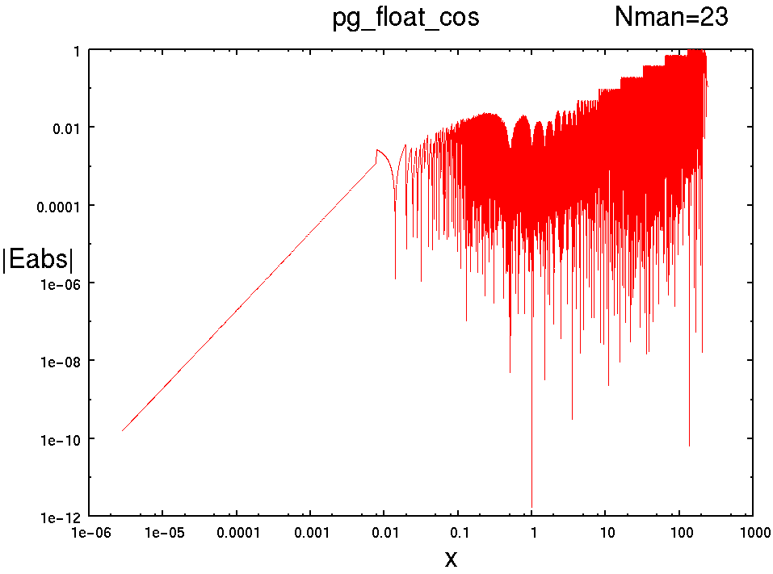
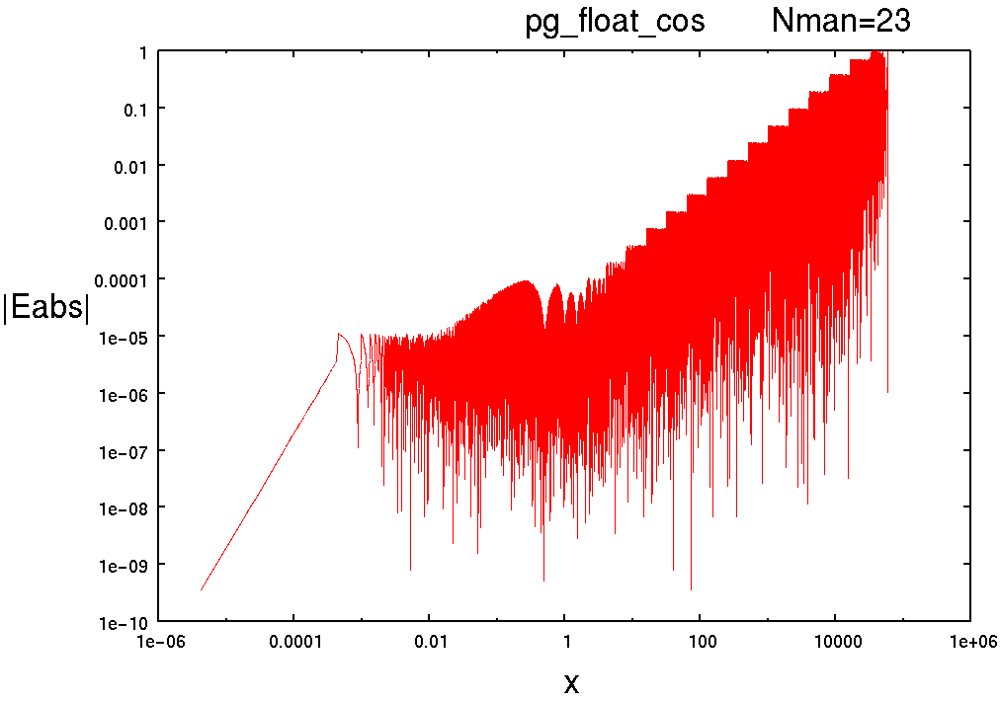
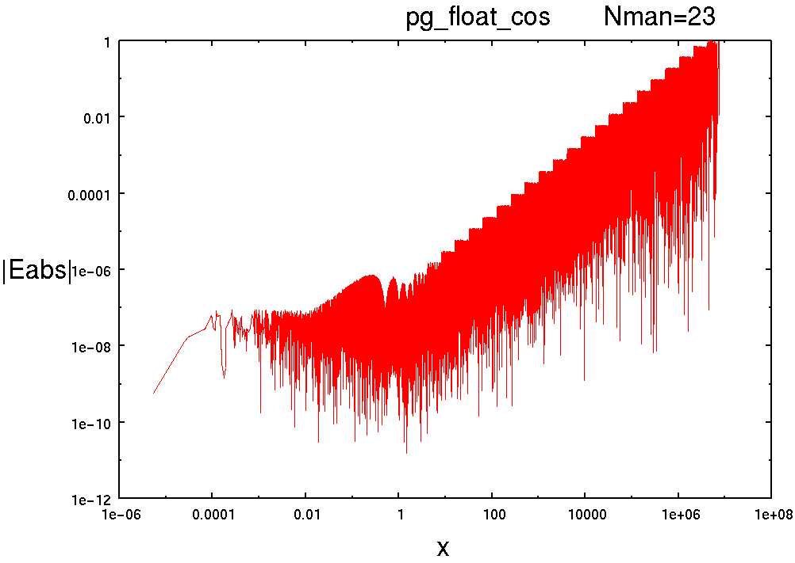
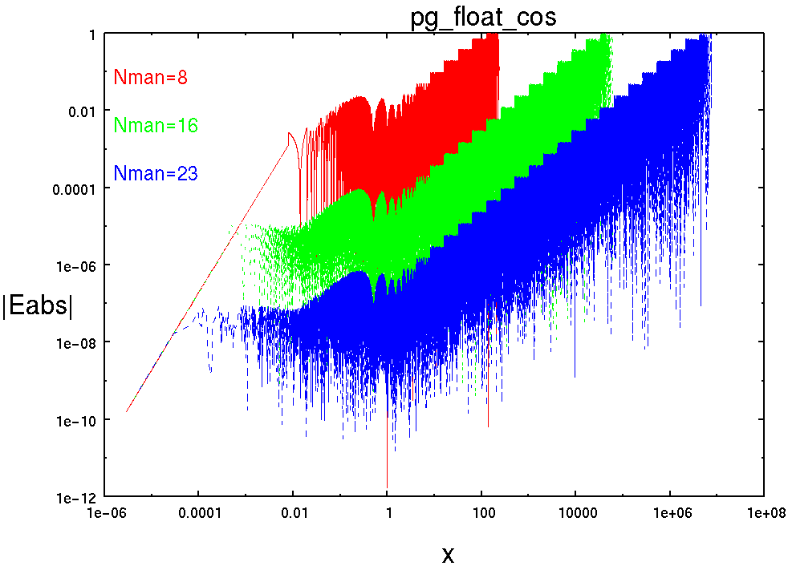

Time-stamp: <2017-01-06 08:08:47 hamada>

# pg_float_cos : 浮動小数点型 コサイン(余弦)関数

## 書式

pg_float_sin(<i>x</i>, <i>z</i>,   <i>NFLO</i>, <i>NMAN</i>, <i>NST</i>);

## 引数

- <i>x</i>: 入力値
- <i>z</i>: 演算結果 : $\cos(2\pi x)$
- <i>NFLO</i>: 浮動小数点ワードビット幅
- <i>NMAN</i>: 仮数部(精度)ビット幅
- <i>NST</i>: パイプラインステージ数

## 記述例

```
pg_float_cos(x, z, 18,  8, 3);
pg_float_cos(x, z, 26, 16, 3);
pg_float_cos(x, z, 33, 23, 3);
```

## 概要

余弦を求める.

$$
z = \sin(2\pi x)
$$


## パイプラインマップ

T.B.D

<!---------------
NMAN 21 以下
NST 1 : 1[-], 2[-], 3[-], 4[-], 5[-], 6[-], 7[-], 8[O]
NST 2 : 1[-], 2[-], 3[-], 4[O], 5[-], 6[-], 7[-], 8[O]
NST 3 : 1[-], 2[-], 3[O], 4[-], 5[O], 6[-], 7[-], 8[O]
NST 4 : 1[-], 2[-], 3[O], 4[O], 5[-], 6[O], 7[-], 8[O]
NST 5 : 1[-], 2[-], 3[O], 4[O], 5[O], 6[O], 7[-], 8[O]

NMAN 22 以上
NST 1 : 1[-], 2[-], 3[-], 4[-], 5[-], 6[-], 7[-], 8[O]
NST 2 : 1[-], 2[-], 3[-], 4[O], 5[-], 6[-], 7[-], 8[O]
NST 3 : 1[-], 2[-], 3[O], 4[-], 5[O], 6[-], 7[-], 8[O]
NST 4 : 1[-], 2[O], 3[-], 4[O], 5[O], 6[-], 7[-], 8[O]
NST 5 : 1[-], 2[O], 3[O], 4[O], 5[O], 6[-], 7[-], 8[O]
NST 6 : 1[-], 2[O], 3[O], 4[O], 5[O], 6[O], 7[-], 8[O]
---------------->

## 性能(Xilinx Virtex-II PRO XC2VP70-5FF1517C)

```
----------------------------------------------------------------------------------------
pg_float_cos(x, z, 18,  8, NST);
NFLO=18
NMAN= 8
NST,    MHz , Cpath, Slices,  FFs,  LUTs, MULT18X18
T.B.D
<!------------------------
1  ,  79.971,  0-8 ,     51,   18,    91,      3
2  , 110.448,  4-8 ,     63,   40,   111,      5
3  , 157.754,  5-8 ,     71,   94,    96,      3
4  , 171.497,  4-6 ,     87,  121,   111,      5
5  , 215.517,  0-3 ,     86,   95,   133,      5
-------------------------->
----------------------------------------------------------------------------------------
pg_float_cos(x, z, 26, 16, NST);
NFLO=26
NMAN=16
NST,    MHz , Cpath, Slices,  FFs,  LUTs, MULT18X18
T.B.D
<!------------------------

1  ,  56.500,  0-8 ,     84,   26,   150,       3
2  ,  94.706,  4-8 ,    107,   56,   194,       5
3  , 127.959,  3-5 ,    116,  158,   155,       3
4  , 146.499,  4-6 ,    140,  185,   194,       5
5  , 188.964,  3-4 ,    140,  159,   224,       5
---------------------------->
----------------------------------------------------------------------------------------
pg_float_cos(x, z, 33, 23, NST);
NFLO=33
NMAN=23
NST,    MHz , Cpath, Slices,  FFs,  LUTs, MULT18X18
T.B.D
<!------------------------
1  ,  38.990,  0-8 ,    347,   33,   620,      10
2  ,  70.210,  0-4 ,    374,   70,   676,      10
3  ,  86.363,  0-3 ,    364,  221,   648,      10
4  , 104.998,  2-4 ,    392,  251,   700,      10
5  , 132.709,  5-8 ,    425,  265,   737,      10 
6  , 141.243,  4-5 ,    425,  285,   737,      10
------------------------->
```

## 演算精度 |Eabs|

### pg_float_cos(x, z, 18,  8, NST);
<a href="../html/img/pg_float_cos_18_8.png">

</a>

### pg_float_cos(x, z, 26, 16, NST);
<a href="../html/img/pg_float_cos_26_16.png">

</a>

### pg_float_cos(x, z, 33, 23, NST);
<a href="../html/img/pg_float_cos_33_23.png">

</a>

### nflo 33/ nflo 26/ nflo 18
<a href="../html/img/pg_float_cos_33.26.18.png">

</a>

## 参照

## Change Log

- 2005.02.06 : 気晴らしに作ってみた. 
