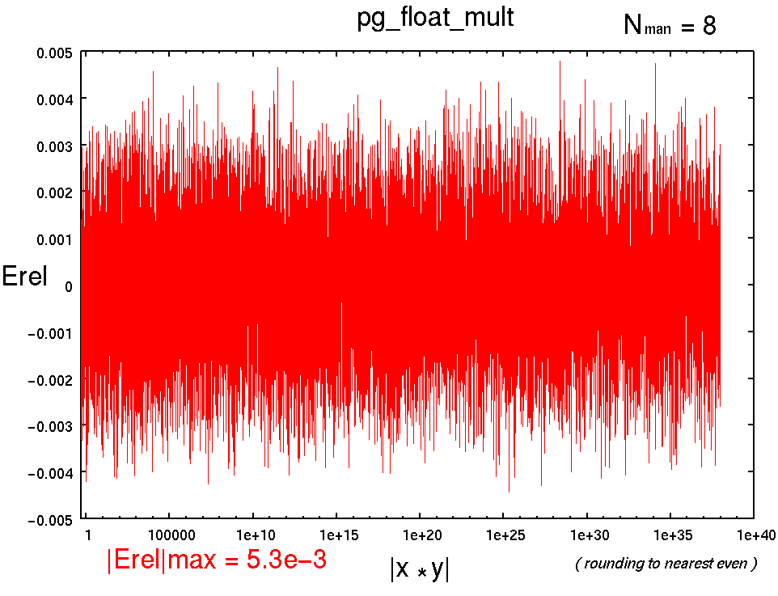
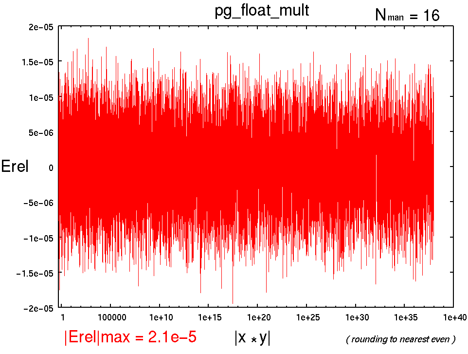
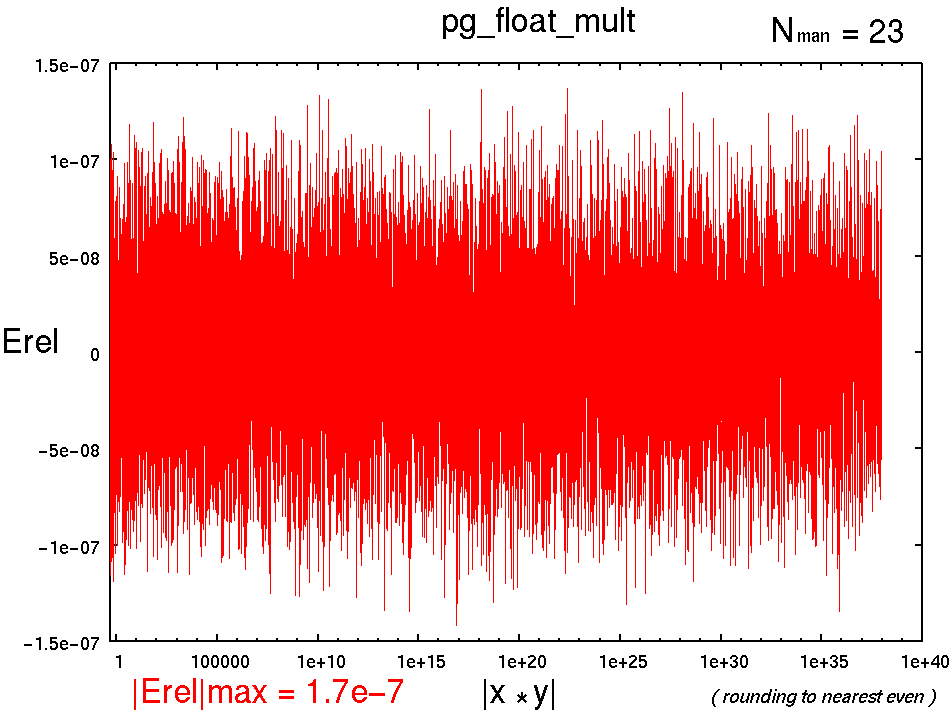

Time-stamp: <>

# pg_float_mult : 浮動小数点型 乗算</h3>

## 書式

pg_float_mult(*x*, *y*, *z*,   *NFLO*, *NMAN*, *NST*,*RM*);


## 引数

- *x*:  被乗数
- *y*:  乗数
- *z*:  乗算結果
- *NFLO*: 浮動小数点ワードビット幅
- *NMAN*:  仮数部(精度)ビット幅
- *NST*:  パイプラインステージ数
- *RM*:  丸めモード(省略可) 全9種類. 省略時はTOEVEN.


## 記述例

```
pg_float_mult(x, y, z, 18,  8, 3, 0);
pg_float_mult(x, y, z, 26, 16, 3);
pg_float_mult(x, y, z, 33, 23, 3);
```


## 概要

x, yとの乗算結果をzに渡す.

## パイプラインマップ (NMAN16を境に切り替え)

```
NMAN 16 以下
NST 1 : 1[-]  2[-]  3[-]  4[-]  5[-]  6[-]  7[O]
NST 2 : 1[-]  2[-]  3[O]  4[-]  5[-]  6[-]  7[O]
NST 3 : 1[-]  2[O]  3[O]  4[-]  5[-]  6[-]  7[O]
NST 4 : 1[-]  2[O]  3[O]  4[-]  5[O]  6[-]  7[O]
NST 5 : 1[-]  2[O]  3[O]  4[O]  5[O]  6[-]  7[O]
NST 6 : 1[-]  2[O]  3[O]  4[O]  5[O]  6[O]  7[O]

NMAN 16 以上
NST 1 : 1[-]  2[-]  3[-]  4[-]  5[-]  6[-]  7[O]
NST 2 : 1[-]  2[O]  3[-]  4[-]  5[-]  6[-]  7[O]
NST 3 : 1[O]  2[O]  3[-]  4[-]  5[-]  6[-]  7[O]
NST 4 : 1[O]  2[O]  3[O]  4[-]  5[-]  6[-]  7[O]
NST 5 : 1[O]  2[O]  3[O]  4[O]  5[-]  6[-]  7[O]
```

## 性能(Xilinx Virtex-II PRO XC2VP70-5FF1517C)

```
----------------------------------------------------------------------------------------
pg_float_mult(x, y, z, 18, 8, NST, 0);
NFLO=18
NMAN= 8
RM=0
NST,    MHz , Cpath, Slices,  FFs,  LUTs, MULT18X18s
1  , 133.387,  0-7 ,     15,   18,    26,          1
2  , 183.993,  0-3 ,     25,   38,    26,          1
3  , 290.192,  3-7 ,     31,   48,    26,          1
4* , 313.480,  0-2 ,     41,   67,    26,          1
5* , 240.558,  4-5 ,     35,   56,    36,          1
6* , 240.558,  5-6 ,     40,   65,    36,          1

(* : not efficient)
(5*は signz0-signz4がシフトレジスタへマップされて遅くなっている.)
(6*も signz0-signz5がシフトレジスタへマップされて遅くなっている.)

----------------------------------------------------------------------------------------
pg_float_mult(x, y, z, 26, 16, NST);
NFLO=26
NMAN=16
RM=6
NST,    MHz , Cpath, Slices,  FFs,  LUTs, MULT18X18s
1  ,  80.762,  0-7 ,     23,   26,    43,          1
2  , 137.250,  0-3 ,     35,   57,    43,          1
3  , 151.953,  3-7 ,     41,   67,    43,          1
4  , 214.270,  3-5 ,     58,   95,    43,          1
5  , 224.266,  2-3 ,     56,   93,    69,          1
6* , 224.266,  2-3 ,     67,  111,    71,          1

(* : not efficient)
----------------------------------------------------------------------------------------
pg_float_mult(x, y, z, 33, 23, NST);
NFLO=33
NMAN=23
RM=6
NST,    MHz , Cpath, Slices,  FFs,  LUTs, MULT18X18s
1  ,  68.847,  0-7 ,     56,   33,   101,          4
2  ,  88.944,  0-2 ,     91,   93,   113,          4
3  , 120.265,  2-7 ,     90,  103,   141,          4
4  , 136.986,  1-2 ,     93,  120,   150,          4

----------------------------------------------------------------------------------------
pg_float_mult(x, y, z, 43, 33, NST);
NFLO=43
NMAN=33
RM=0
NST,    MHz , Cpath, Slices,  FFs,  LUTs, MULT18X18s
1  ,  64.821,  0-7 ,     81,   43,   151,          4
2  ,  82.488,  0-2 ,    107,   90,   150,          4
3  ,  88.842,  0-1 ,    226,  214,   280,          9

```

## 演算精度 ```|Erel|max```

<ul>
<li>
    <h3>pg_float_mult(x, y, z, 18,  8, NST, 6);</h3>
    <h3>|Erel|max = 5.3e-3</h3>
    <a href="../html/img/pg_float_mult_18_8_6.png">
    
    </a>
<li>
    <h3>pg_float_mult(x, y, z, 26, 16, NST, 6);</h3>
    <h3>|Erel|max = 2.1e-5</h3>
    <a href="../html/img/pg_float_mult_26_16_6.png">
    
    </a>
<li>
    <h3>pg_float_mult(x, y, z, 33, 23, NST, 6);</h3>
    <h3>|Erel|max = 1.7e-7</h3>
    <a href="../html/img/pg_float_mult_33_23_6.png">
    
    </a>
</ul>


## 参照

## Change Log

- 2004.10.10 : the first edition by T. Hamada
